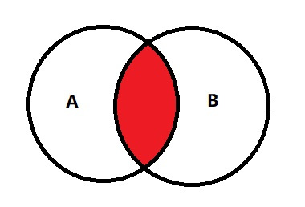
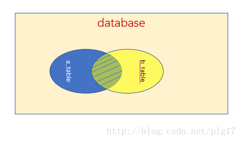

# 简介
sql99 语法是现在最流行的`select`语法。相较于92语法，其拥有更多的关键字以供使用。

# 语法

```
select 输出项s                      # 输出项，理论上输出时是单行遍历方式输出（很重要，这对理解子查询时很有帮助）
from tableName                     # 主表
(inner/left/right) join tablename  # 匹配表，有内联，左外，右外链接等方式。mysql不支持全外链接
on link_condition                  # 主表和匹配表的链接条件，与92相比链接条件单独提出为单一的关键字语句
where conditions                   # 筛选条件
group by col                       # 分组目标
having conditions                  # 分组后筛选条件
order by col (desc/asc)            # 排序条件
limit index length                 # 分页工具
```

# 链接方式
## inner链接
>inner 链接与92语法的等值链接相同，都是求两个表的交集
>即：

## left链接
>左外链接和右外链接相似，理论上将主表和匹配表交换位置之后，左外即成为原来的右外。
>即：

> 表a将会以自己为基准去匹配表b。将表b与a匹配的相关项匹配到a表中，a表中没有被b匹配的项，匹配为null

> 即:

## right链接
> 不再赘述

# 分页查询
> 在传统使用时，客户页面很难一次将数据库的`select`的输出完全展示出来。客户的当前页面可能只能显示一定数量的数据。sql99提供了limit关键字用来满足这种情况
## 语法
```
limit index length 
```
`select` 将从index处，遍历length的长度的数据进行输出。仅需要记录index，便可以分页的将数据库进行显示。