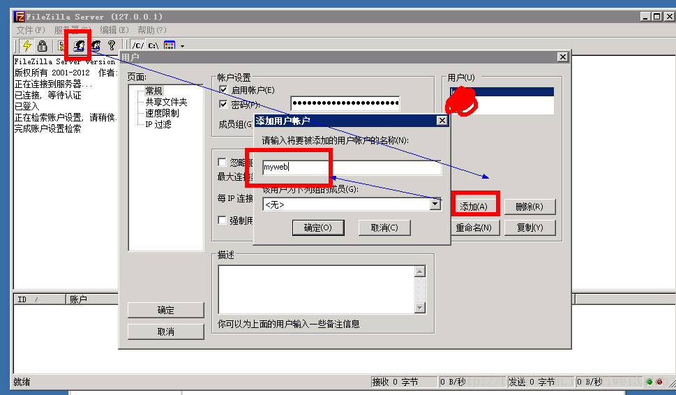
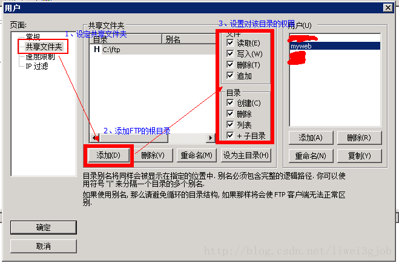
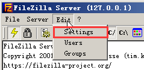
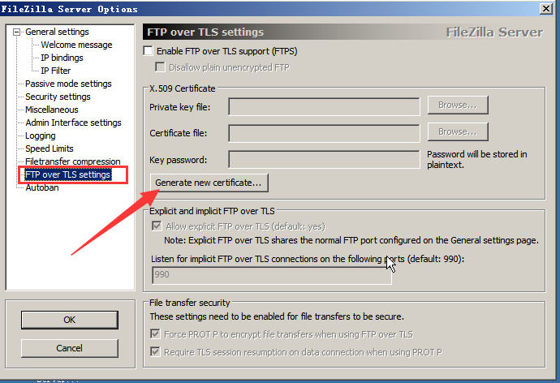
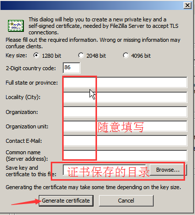
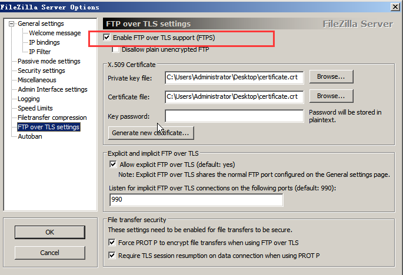

# 简介

本文主要用于 `FTPS` 安全文件服务器的搭建作业。同时包含使用Qt作为工具的 `ftps-client`的主要设计方法和源码介绍

# 背景

本公司存在安全文件服务器的搭建和使用需求

# 原材料

FileZilla Server 0.9.41 中文安装版，Qt 5.6.3，Openssl windows版。

# 服务器搭建

## 下载安装FileZilla
### 下载地址
[https://www.filezilla.cn/download/server](https://www.filezilla.cn/download/server)

### 安装和启用

* 将下载的 `.zip` 包解压放到系统盘 `\Program Files (x86)` 文件夹下
* 以管理员权限运行 `FileZilla server.exe`
* 双击 `FileZilla Server Interface.exe`,输入服务器安装的设备的IP地址，若是本地则输入 `127.0.0.1`,密码可随意输入。不过为了公司内部统一，密码统一输入为 `1qaz@WSX`。确定后，即可进入服务器管理界面

## 配置服务器

### 创建用户

#### 说明

* 本项目应当添加两个用户，同时他们拥有着不同的访问权限，在下一步有权限访问设置
* 密码设置统一为 `1qaz@WSX`
* 账户名可以随意设置，但是应当对其作用应当有体现

### 设置共享文件夹



#### 说明

* 在用户框选中需设置的用户，然后进行设置操作
* 上步所设置的用户，应当拥有相同的共享文件夹。一个账号拥有全部权限，一个仅拥有写入权限。

## 配置SSL

### 打开设置界面


### 创建证书



### 证书信息



```
Key size  2048 bit

2-DIgit country code: 86

Full state or province: BeiJing

Locality(City): BeiJing

Origanization : fbt

Origanization unit： fbt/soft

Contact E-Mail:  #yourself

Common name : #server IP

```

### 开启SSL





# Qt客户端

## 设计方法

## 主要代码


# 引用

[https://www.cnblogs.com/wanghuaijun/p/5476696.html](https://www.cnblogs.com/wanghuaijun/p/5476696.html "搭建服务器1")
[https://yq.aliyun.com/articles/696231](https://yq.aliyun.com/articles/696231 "服务器搭建2")


