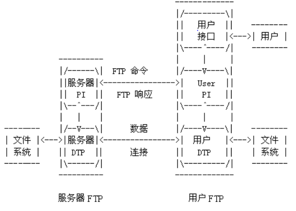
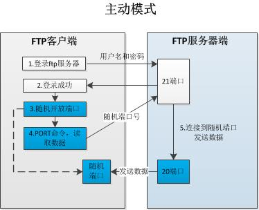
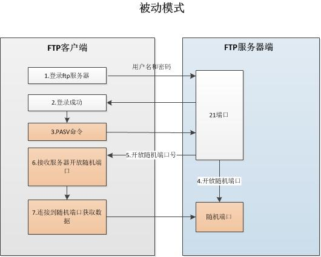
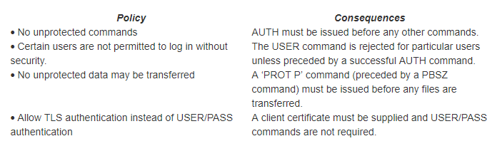

# 简介

本文主要用于 `FTPS` 安全文件服务器的搭建作业。同时包含使用Qt作为工具的 `ftps-client`的主要设计方法和源码介绍

# 背景

本公司存在安全文件服务器的搭建和使用需求

# 原材料

FileZilla Server 0.9.41 中文安装版，Qt 5.6.3，Openssl windows版,QFtp。

# 服务器搭建

## 下载安装FileZilla
### 下载地址
[https://www.filezilla.cn/download/server](https://www.filezilla.cn/download/server)

### 安装和启用

* 将下载的 `.zip` 包解压放到系统盘 `\Program Files (x86)` 文件夹下
* 以管理员权限运行 `FileZilla server.exe`
* 双击 `FileZilla Server Interface.exe`,输入服务器安装的设备的IP地址，若是本地则输入 `127.0.0.1`,密码可随意输入。不过为了公司内部统一，密码统一输入为 `1qaz@WSX`。确定后，即可进入服务器管理界面

## 配置服务器

### 创建用户

#### 说明

* 本项目应当添加两个用户，同时他们拥有着不同的访问权限，在下一步有权限访问设置
* 密码设置统一为 `1qaz@WSX`
* 账户名可以随意设置，但是应当对其作用应当有体现

### 设置共享文件夹


#### 说明

* 在用户框选中需设置的用户，然后进行设置操作
* 上步所设置的用户，应当拥有相同的共享文件夹。一个账号拥有全部权限，一个仅拥有写入权限。

## 配置SSL

### 打开设置界面


### 创建证书


### 证书信息


```
Key size  2048 bit

2-DIgit country code: 86

Full state or province: BeiJing

Locality(City): BeiJing

Origanization : fbt

Origanization unit： fbt/soft

Contact E-Mail:  #yourself

Common name : #server IP

```

### 开启SSL


# ftp协议介绍

## 简介

FTP的目标是提高文件的共享性，提供非直接使用远程计算机，使存储介质对用户透明和可靠高效地传送数据。虽然我们也可以手工使用它，但是它的主要作用是供程序使用的。

* 字节大小，在FTP中字节大小有两个：逻辑字节大小和用于传输的字节大小。后者通常是8位，而前者可不一定是多少了。传输 字节不必等于逻辑字节大小，也不必对数据结构进行解释。
* 控制连接是建立在`USER-PI`和`SERVER-PI`之间用于交换命令与应答的通信链路。
* 数据连接是传输数据的全双工连接。传输数据可以发生在`SERVER-DTP`和`USER-DTP`之间也可以发生在两个`SERVER-DTP`之间。
* DTP：数据传输过程建立和管理数据连接，`DTP`代表一种传输过程，它通常处于“主动”状态，它和侦听端口建立数据连接，它还可以为传输和存储设置参数，并根据PI的指令传输数据。当然，`DTP`也可以转入“被动”状态。
* EOR：代表记录尾。
* NTV：代表网络虚拟终端，它的定义与在 `Telne`t协议中的定义一致。
* NVFS：代表网络虚拟文件系统。
* FTP可以传输非连续的文件，这些文件的一部分称为页。
* PI：代表协议解释器和FTP的控制通道。 
* 服务器FTP进程，它是和用户FTP进程一起工作的，它由`PI`和`DTP`组成。至于用户FTP进程则是 由`PI`，`DTP`和用户接口组成的。

工作原理如下图：



## ftp的主动模式和被动模式

### PORT（主动模式）
`PORT`中文称为主动模式，工作的原理： FTP客户端连接到FTP服务器的`21`端口，发送用户名和密码登录，登录成功后要list列表或者读取数据时，客户端随机开放一个端口（`1024`以上），发送`PORT`命令到FTP服务器，告诉服务器客户端采用主动模式并开放端口；FTP服务器收到`PORT`主动模式命令和端口号后，通过服务器的20端口和客户端开放的端口连接，发送数据，原理如下图：



### PASV（被动模式）
`PASV`是`Passive`的缩写，中文成为被动模式，工作原理：FTP客户端连接到FTP服务器的21端口，发送用户名和密码登录，登录成功后要list列表或者读取数据时，发送`PASV`命令到FTP服务器， 服务器在本地随机开放一个端口（1024以上），然后把开放的端口告诉客户端， 客户端再连接到服务器开放的端口进行数据传输，原理如下图：



### 两种模式的比较
从上面的运行原来看到，主动模式和被动模式的不同简单概述为： 主动模式传送数据时是“服务器”连接到“客户端”的端口；被动模式传送数据是“客户端”连接到“服务器”的端口。
主动模式需要客户端必须开放端口给服务器，很多客户端都是在防火墙内，开放端口给FTP服务器访问比较困难。
被动模式只需要服务器端开放端口给客户端连接就行了。

因服务器防火墙设置较为方便，所以采用服务器开放随机端口的被动模式。本公司服务端被动端口设置为`50000-60000`范围，在防火墙方面应当将此范围的端口打开。

# ftp over ssl

## 简介
普通FTP的一个重要问题是它不安全 - 用户名，密码和数据以明文形式通过网络发送。这意味着窃听网络的窃听者在获取传输文件的凭据和副本时几乎没有什么问题。

FTPS协议旨在通过使用`SSL/TLS`协议加密通信来解决此问题，该协议专门用于保护网络连接。

FTPS是`RFC4217`中描述的`IETF`标准。

## 隐式FTPS和显式FTPS

FTPS协议的早期版本现在称为隐式FTPS协议。连接后，隐式FTPS协议客户端会自动使用`SSL/TLS`开始保护连接。

对于未加密的FTP客户端，这是一个问题 - 它们将无法再在需要立即保护连接的服务器端口上进行连接。如果在同一服务器上支持FTP和FTPS（隐式），则它们需要不同的端口号。通常，隐式FTPS协议使用端口`990`而不是标准FTP端口`21`。

显式FTPS通过要求在保护连接之前由客户端发送AUTH命令来解决此问题。这意味着未加密的FTP客户端可以在与FTPS协议客户端相同的端口上连接 - 未加密的客户端根本不会发送`AUTH`命令，并且会话保持未加密状态。FTPS协议客户端在登录之前发送`AUTH`命令，以便保护凭据。

仍然可以找到隐式FTPS客户端，但始终首选显式模式。除非需要隐式模式，否则最好在`CompleteFTP`中禁用隐式模式FTPS协议。

## 保护控制和数据通道
FTP会话使用两个通道：控制和数据。在每个会话中仅使用一个控制信道，但是可以使用几个数据信道 - 每个数据信道用于一次数据传输。`AUTH`命令仅保护控制通道。在发出`PBSZ`和`PROT`命令之前，数据通道不受保护。这些命令告诉服务器后续数据通道是否应该是安全的。

客户端可以以未加密模式连接到FTPS服务器，然后根据请求切换到安全模式。为此，客户端发出`AUTH`命令，客户端和服务器在该命令上协商安全连接。在切换之后，所有`FTP`命令都被加密，但重要的是，除非提供进一步的命令，否则数据不会被加密。

## FTPS协议命令
使用三个命令，`AUTH`，`PBSZ`和`PROT`。其中一个`PBSZ`似乎是多余的，可能仅包括满足RFC规范。

### AUTH (AUTHentication)
`AUTH`命令采用单个参数来定义要使用的安全机制，通常是`SSL`或`TLS`。
```
AUTH TLS
使用此命令，尝试协商控制通道上的TLS连接。服务器尝试通过发送其证书（服务器验证）来向客户端验证自身。它还可能涉及客户端将其证书发送到服务器（客户端验证）。
```

### PBSZ (Protection Buffer SiZe)
`PBSZ`命令用于定义安全机制在加密数据通道上的数据时要使用的缓冲区大小。但是对于`TLS`，此设置是多余的，值`0`始终作为参数传递。
```
PBSZ 0
虽然此调用是多余的，但它是必需的，必须在PROT命令之前。
```

### PROT (data channel PROTection level)

`PROT`定义数据通道是否受保护。数据通道为 `clear`（默认）或`private`。`clear`意味着数据通道上没有使用安全性（意味着文件是在没有加密的情况下传输的），而私有意味着数据通道应该被加密。所以有两种可能的PROT命令：

```
PROT C.
对于不安全的数据通道
PROT P.
对于加密的数据通道。
```

## FTP主要工作流程
### 典型的显式FTPS会话

```
> USER (user-name)
Provide user-name
> PASS (password)
Provide password
> LIST
Get a directory listing
> AUTH TLS
Switch to TLS on control-channel
> RETR (file-name)
Download a file (without security)
> PBSZ 0
> PROT P
Switch to TLS on the data-channel
> STOR (file-name)
Upload a file (with security)
> QUIT
End session
```
在此示例中，前三个命令```USER丶PASS丶LIST```是标准FTP，因此不安全。`AUTH`命令使其余命令安全地发送到服务器，换句话说，攻击者无法看到发出了哪些命令。在`AUTH`之后的`RETR`命令（从服务器获取文件）受到保护，但传输的实际文件不受保护，因为它在`PBSZ`和`PROT`命令之前。`PBSZ`和`PROT`告诉服务器在所有未来的数据通道上使用`TLS`，因此在`STOR`命令（将文件存储在服务器上）中传输的文件是安全的。

## Ruler

There are two rules regarding the issuing of explicit FTPS protocol commands that must be followed:
```
AUTH must precede PBSZ		
PBSZ must precede PROT
```

除此之外，FTPS服务器还有关于其资源的访问权限的策略。这些策略还将确定必须发出命令的顺序。此处列出了太多可能的策略，但下面给出了一些此类策略的示例以及它们在发出命令方面的后果。



# Qt客户端

## 设计方法

## 主要代码


# 引用

[https://www.cnblogs.com/wanghuaijun/p/5476696.html](https://www.cnblogs.com/wanghuaijun/p/5476696.html "搭建服务器1")
[https://yq.aliyun.com/articles/696231](https://yq.aliyun.com/articles/696231 "服务器搭建2")
[https://www.cnblogs.com/mawanglin2008/articles/3607767.html](https://www.cnblogs.com/mawanglin2008/articles/3607767.html "ftp的主被动模式")
[https://wenku.baidu.com/view/8020ae05cc175527072208da.html](https://wenku.baidu.com/view/8020ae05cc175527072208da.html "RFC959_Chinese")
[https://enterprisedt.com/ftps/](https://enterprisedt.com/ftps/ "ftps协议")


